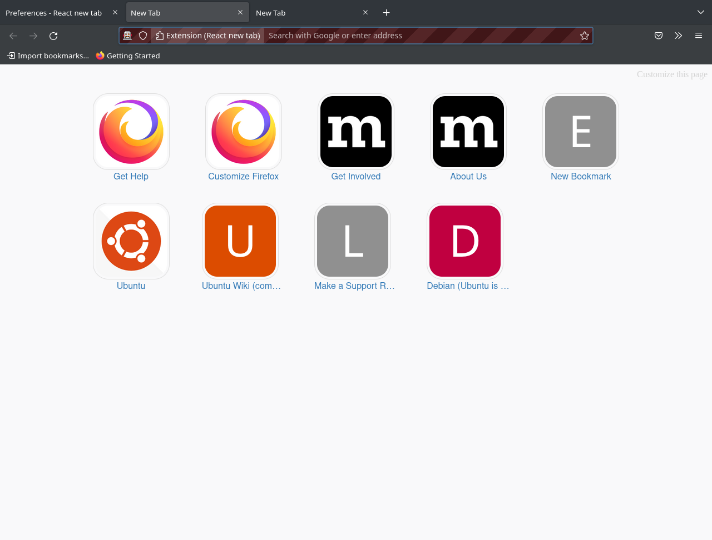

# React New Tab CSS Templates

This is a place to find CSS templates for React new tab.

Please feel free to add your template by creating a pull request to the `master` branch.

-------

## List of predefined templates

* [Rounded thumbnails](#rounded-thumbnails)
* [Blank page](#blank-page)
* [Solarized light](#solarized-light)
* [Tomorrow Night](#tomorrow-night)
* [No Icon borders](#no-icon-borders)
* [Background image](#background-image)

-------

## Rounded thumbnails

Changes the shape of icons to be a rounded square.

### Code

```css
.thumbnail{

  border-radius: 20%;
}
```

### Screenshot



> **NOTE**: If you need a different shape, please refer to the `border-radius` css property. [Documentation is available here.](https://developer.mozilla.org/en-US/docs/Web/CSS/border-radius)

-------

## Blank page

Show a blank page as the new tab

### Code

```css
.container{
 display: none;
}
```

### Screenshot


-------

## Solarized light

Solarized light theme

### Code

```css
body{
 background-color: #FDF6E3;
}

.text{
 color: #2aa198;
}
```

### Screenshot


-------

## Tomorrow Night

Tomorrow Night theme

### Code

```css
body{
 background-color: #1D1F21;
}

.text{
 color: #C5C8C6;
}

.thumbnail{
 border-color: #AEAFAD;
}
```

### Screenshot


-------

## No Icon borders

Do not have a border for the icons.

### Code

```css
.thumbnail{
 border-style: none;
}
```

### Screenshot


-------

## Background Image

Load a random background image from unsplash.com

### Code

```css
body{
  background-image: url('https://source.unsplash.com/random/1920x1080');
  background-attachment: fixed;
  background-repeat: no-repeat;
}
```

### Screenshot


